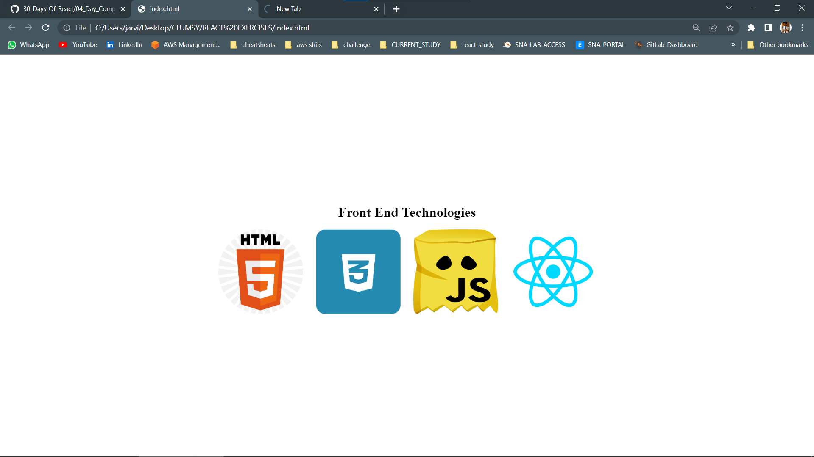
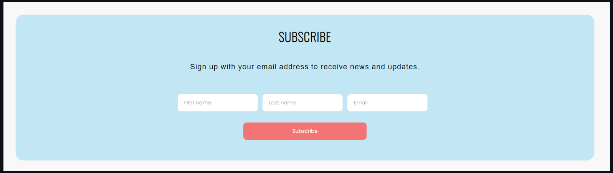
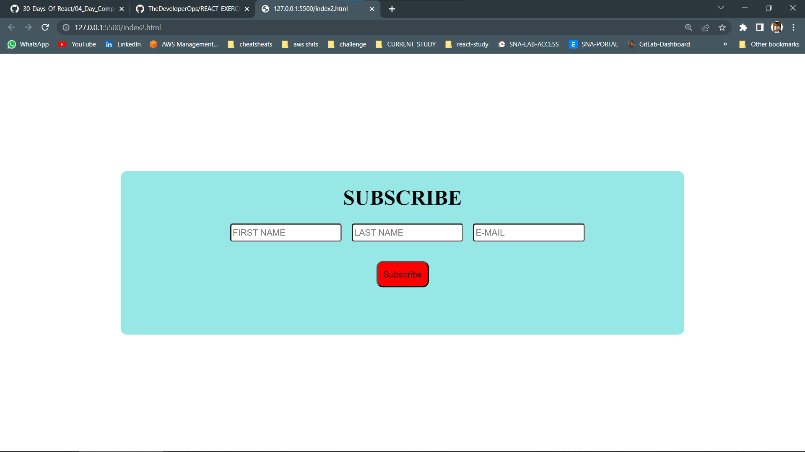

# REACT EXERCISES

## COMPONENTS

**1. Create a functional component and display the following images.**


*My code answer*
```
<!DOCTYPE html>
<html lang="en">
<head>
    <meta charset="UTF-8">
    <meta name="viewport" content="width=device-width, initial-scale=1.0">
    <script crossorigin src="https://unpkg.com/react@18/umd/react.development.js"></script>
    <script crossorigin src="https://unpkg.com/react-dom@18/umd/react-dom.development.js"></script>
    <script src="https://unpkg.com/@babel/standalone/babel.min.js"></script>
    <style>
        h1 {
            text-align: center;
        }
    .container {
        position: fixed;
     top: 50%;
     left: 50%;
     transform: translate(-50%, -50%); 

      }
      .image{
        margin-left: 15px ;
        margin-right: 15px;
      }
    </style>
</head>
<body>
    
    <div id="app"></div>
    <script type="text/babel">
        const ShowHtml=()=>{
            return 
        }
        const ShowJs=()=>{
            return 
        }
        const ShowCss=()=>{
            return 
        }
        const ShowReact=()=>{
            return 
        }
        class HelloWorld extends React.Component{
            render(){
                return(
                    <div className="container" >
                        <div><h1>Front End Technologies</h1></div>
                        <ShowHtml />
                        <ShowCss />
                        <ShowJs />
                        <ShowReact />
                    </div>
                );
            }
        }
        const rootElement = ReactDOM.createRoot(document.getElementById('app'))
        rootElement.render(<HelloWorld/>)
        
    </script>
</body>
</html>
```
*Output*


**2. Use functional component to create the following design**


```
<!DOCTYPE html>
<html lang="en">
<head>
    <meta charset="UTF-8">
    <meta name="viewport" content="width=device-width, initial-scale=1.0">
    <script crossorigin src="https://unpkg.com/react@18/umd/react.development.js"></script>
    <script crossorigin src="https://unpkg.com/react-dom@18/umd/react-dom.development.js"></script>
    <script src="https://unpkg.com/@babel/standalone/babel.min.js"></script>
    <style>
    .container {
        text-align: center;
        border-radius: 10px;
        height: 250px;
        width: 70%;
        display: block;
        background-color: rgb(151, 231, 231);
        position: fixed;
        top: 50%;
        left: 50%;
        transform: translate(-50%, -50%);
        }
        input{
        margin-left: 15px;
        border-radius: 4px;
        height: 22px;
        }
        button{
        display: block;
        margin: 0 auto;
        margin-top: 30px;
        height: 40px;
        width: 80px;
        background-color: red;
        border-radius: 10px;
      }
    </style>
</head>
<body>
    
    <div id="app"></div>
    <script type="text/babel">
        const InputGet=()=>{
            return(
                <div className="inputDiv">
                    <input className="input" type='text' placeholder="FIRST NAME" />
                    <input className="input" type='text' placeholder="LAST NAME" />
                    <input className="input" type='text' placeholder="E-MAIL"/>
                    <button type='submit'>Subscribe</button>
                </div>
            )
        }
        const Subscribe=()=>{
                return(
                    <div className='container'>
                        <h1>SUBSCRIBE</h1>
                        <InputGet/>
                    </div>
                )
        }
        const rootElement = ReactDOM.createRoot(document.getElementById('app'))
        rootElement.render(<Subscribe/>)
        
    </script>
</body>
</html>
```
*output of the following*
