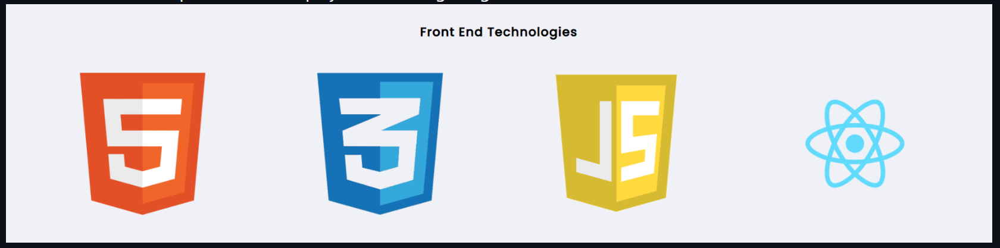

# REACT EXERCISES

## COMPONENTS

**1. Create a functional component and display the following images.**



*My code answer*
```
<!DOCTYPE html>
<html lang="en">
<head>
    <meta charset="UTF-8">
    <meta name="viewport" content="width=device-width, initial-scale=1.0">
    <script crossorigin src="https://unpkg.com/react@18/umd/react.development.js"></script>
    <script crossorigin src="https://unpkg.com/react-dom@18/umd/react-dom.development.js"></script>
    <script src="https://unpkg.com/@babel/standalone/babel.min.js"></script>
    <style>
        h1 {
            text-align: center;
        }
    .container {
        position: fixed;
     top: 50%;
     left: 50%;
     transform: translate(-50%, -50%); 

      }
      .image{
        margin-left: 15px ;
        margin-right: 15px;
      }
    </style>
</head>
<body>
    
    <div id="app"></div>
    <script type="text/babel">
        const ShowHtml=()=>{
            return 
        }
        const ShowJs=()=>{
            return 
        }
        const ShowCss=()=>{
            return 
        }
        const ShowReact=()=>{
            return 
        }
        class HelloWorld extends React.Component{
            render(){
                return(
                    <div className="container" >
                        <div><h1>Front End Technologies</h1></div>
                        <ShowHtml />
                        <ShowCss />
                        <ShowJs />
                        <ShowReact />
                    </div>
                );
            }
        }
        const rootElement = ReactDOM.createRoot(document.getElementById('app'))
        rootElement.render(<HelloWorld/>)
        
    </script>
</body>
</html>
```
*Output*


**2. Use functional component to create the following design**


```
<!DOCTYPE html>
<html lang="en">
<head>
    <meta charset="UTF-8">
    <meta name="viewport" content="width=device-width, initial-scale=1.0">
    <script crossorigin src="https://unpkg.com/react@18/umd/react.development.js"></script>
    <script crossorigin src="https://unpkg.com/react-dom@18/umd/react-dom.development.js"></script>
    <script src="https://unpkg.com/@babel/standalone/babel.min.js"></script>
    <style>
    .container {
        text-align: center;
        border-radius: 10px;
        height: 250px;
        width: 70%;
        display: block;
        background-color: rgb(151, 231, 231);
        position: fixed;
        top: 50%;
        left: 50%;
        transform: translate(-50%, -50%);
        }
        input{
        margin-left: 15px;
        border-radius: 4px;
        height: 22px;
        }
        button{
        display: block;
        margin: 0 auto;
        margin-top: 30px;
        height: 40px;
        width: 80px;
        background-color: red;
        border-radius: 10px;
      }
    </style>
</head>
<body>
    
    <div id="app"></div>
    <script type="text/babel">
        const InputGet=()=>{
            return(
                <div className="inputDiv">
                    <input className="input" type='text' placeholder="FIRST NAME" />
                    <input className="input" type='text' placeholder="LAST NAME" />
                    <input className="input" type='text' placeholder="E-MAIL"/>
                    <button type='submit'>Subscribe</button>
                </div>
            )
        }
        const Subscribe=()=>{
                return(
                    <div className='container'>
                        <h1>SUBSCRIBE</h1>
                        <InputGet/>
                    </div>
                )
        }
        const rootElement = ReactDOM.createRoot(document.getElementById('app'))
        rootElement.render(<Subscribe/>)
        
    </script>
</body>
</html>
```
*output of the following*


**3. Use the given hexadecimal color generator in the example to create these random colors**


```
<!DOCTYPE html>
<html lang="en">
<head>
    <meta charset="UTF-8">
    <meta name="viewport" content="width=device-width, initial-scale=1.0">
    <script crossorigin src="https://unpkg.com/react@18/umd/react.development.js"></script>
    <script crossorigin src="https://unpkg.com/react-dom@18/umd/react-dom.development.js"></script>
    <script src="https://unpkg.com/@babel/standalone/babel.min.js"></script>
    <style>
        .container{
            position: fixed;
                top: 50%;
                left: 50%;
                transform: translate(-50%, -50%);
        }
        h1{
            text-align: center;
        }
    </style>
</head>
<body>
    
    <div id="app"></div>
    <script type="text/babel">
        const HexaCode=(props)=>{
            const styleOne = {
                textAlign:'center',
                background: props.color[0],
                height: 40,
                width: 600,
                fontSize: 32,
                marginTop:10    
            }
            const styleTwo = {
                textAlign:'center',
                background: props.color[1],
                height: 40,
                width: 600,
                fontSize: 32,
                marginTop:10    
            }
            const styleThree = {
                textAlign:'center',
                background: props.color[2],
                height: 40,
                width: 600,
                fontSize: 32,
                marginTop:10    
            }
            const styleFour = {
                textAlign:'center',
                background: props.color[3],
                height: 40,
                width: 600,
                fontSize: 32,
                marginTop:10    
            }
            const styleFive = {
                textAlign:'center',
                background: props.color[4],
                height: 40,
                width: 600,
                fontSize: 32,
                marginTop:10    
            }
            const styleSix = {
                textAlign:'center',
                background: props.color[4],
                height: 40,
                width: 600,
                fontSize: 32,
                marginTop:10    
            }
            return(
                <div>
                    <h1>Random Hex code </h1>
                    <div style={styleOne}>{props.color[0]}</div>
                    <div style={styleTwo}>{props.color[1]}</div>
                    <div style={styleThree}>{props.color[2]}</div>
                    <div style={styleFour}>{props.color[3]}</div>
                    <div style={styleFive}>{props.color[4]}</div>
                    <div style={styleSix}>{props.color[5]}</div>
               
                </div>
                
            )
        }
        const HexaGenerator=()=>{
            let letters = "0123456789ABCDEF";
            let colorList = [];

            for (let i = 0; i < 6; i++) {
            let color = '#';

            for (let j = 0; j < 6; j++) {
                color += letters[Math.floor(Math.random() * 16)];
            }
            if (!colorList.includes(color)) {
                colorList.push(color);
            } else {
                i--; // Generate a new color if the current one already exists in the list
            }
            }
                return(
                    <div className='container'>
                        <HexaCode color={colorList}/>
                    </div>
                )
        }
        const rootElement = ReactDOM.createRoot(document.getElementById('app'))
        rootElement.render(<HexaGenerator/>)
        
    </script>
</body>
</html>
```
*Output for the above*


**4. Use functional component to design the following user card.**


```
<!DOCTYPE html>
<html lang="en">
<head>
    <meta charset="UTF-8">
    <meta name="viewport" content="width=device-width, initial-scale=1.0">
    <script crossorigin src="https://unpkg.com/react@18/umd/react.development.js"></script>
    <script crossorigin src="https://unpkg.com/react-dom@18/umd/react-dom.development.js"></script>
    <script src="https://unpkg.com/@babel/standalone/babel.min.js"></script>
    <style>
        body{
            background-color: rgb(184, 187, 190);
        }
        .container{
            border-radius: 10px;
            height: 470px;
            width: 80%;
            display: block;
            background-color: rgb(239, 243, 243);
            position: fixed;
            top: 50%;
            left: 50%;
            transform: translate(-50%, -50%);
        }
        img{
            border-radius: 50;
        }
        .boxed *{
            text-align: center;
            margin-left: 20px;
            float: left;
            margin-top: 10px;
            border-radius: 3px;
            background-color: rgb(37, 203, 224);
            border: 2px solid rgb(37, 203, 224) ;
            width: 70px;
        }
    </style>
</head>
<body>
    
    <div id="app"></div>
    <script type="text/babel">
        const ShowCard=()=>{
            return(
                <div>
                    
                    <h1  style={{fontSize:30,paddingLeft:40}}>JAGAN T</h1>
                    <h2 style={{fontSize:15,paddingLeft:20}}> MERN STACK DEVELOPER</h2>
                    <h1 style={{fontSize:30,paddingLeft:40}}>SKILLS</h1>
                    <div className='boxed'>
                    <div>HTML</div><div>CSS</div><div>JS</div><div>REACT</div><div>PYTHON</div><div>MYSQL</div><div>JAVA</div><div>REDUX</div>
                    </div>
                    </div>
            )
        }
        class UserCard extends React.Component{
            render(){
                return(
                    <div className="container" >
                        <ShowCard/>
                    </div>
                );
            }
        }
        const rootElement = ReactDOM.createRoot(document.getElementById('app'))
        rootElement.render(<UserCard/>)   

    </script>
</body>
</html>
```

*Output of the above*
