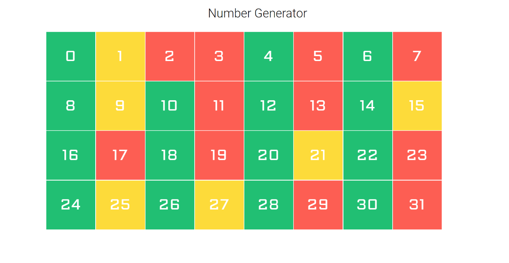
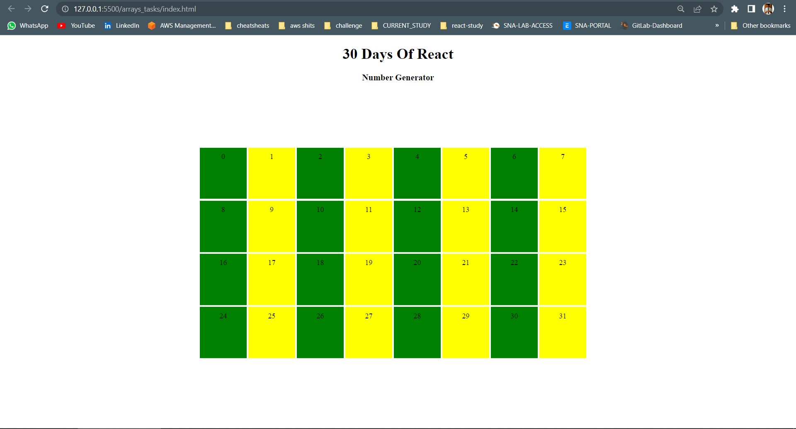
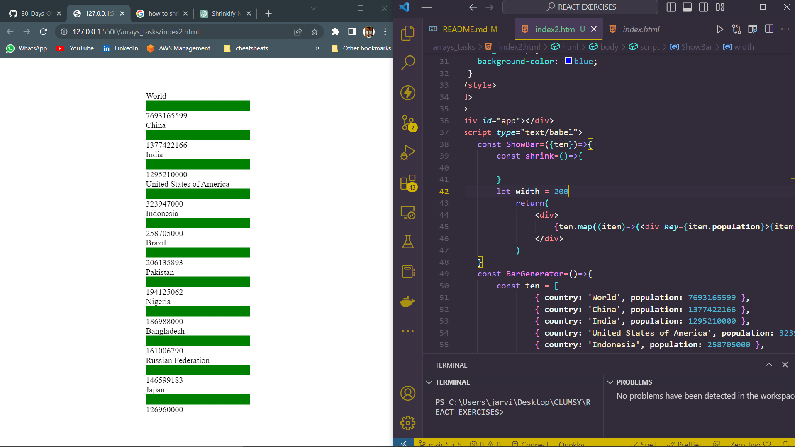

# REACT EXERCISES

## ARRAY

**1.In the following design, evens are green, odds are yellow and prime numbers are red. Build the following colors using React component**


```
<!DOCTYPE html>
<html lang="en">
<head>
    <meta charset="UTF-8">
    <meta name="viewport" content="width=device-width, initial-scale=1.0">
    <script crossorigin src="https://unpkg.com/react@18/umd/react.development.js"></script>
    <script crossorigin src="https://unpkg.com/react-dom@18/umd/react-dom.development.js"></script>
    <script src="https://unpkg.com/@babel/standalone/babel.min.js"></script>
    <style>
        h1,h3 {
            text-align:center;
        }
    .container {
        display: flex;
        position: fixed;
        top: 50%;
        left: 50%;
        transform: translate(-50%, -50%); 
      }
      .aligned-boxes{
        margin-top: 90px;
        
      }
      .box{
        margin: 2px;
        padding-top: 0px;
        text-align: center;
        float: left;
        width: 100px; 
        height: 100px;
        background-color: blue;
      }
    </style>
</head>
<body>
    <h1>30 Days Of React</h1>
    <h3>Number Generator</h3>
    <div id="app"></div>
    <script type="text/babel">
        const ShowBoxedNumber=()=>{
            let listOfNum=[0,1,2,3,4,5,6,7,8,9,10,11,12,13,14,15,16,17,18,19,20,21,22,23,24,25,26,27,28,29,30,31,]
            const evenBox={
                margin: 2,
                paddingTop: 10,
                textAlign: 'center',
                float: 'left',
                width: 100, 
                height: 100,
                backgroundColor: 'green',
            }
            const OddBox={
                margin: 2,
                paddingTop: 10,
                textAlign: 'center',
                float: 'left',
                width: 100, 
                height: 100,
                backgroundColor: 'yellow',
            }
            const primeBox={
                margin: 2,
                paddingTop: 10,
                textAlign: 'center',
                float: 'left',
                width: 100, 
                height: 100,
                backgroundColor: 'red',
            }
            const isPrime = (number) => {
                if (number < 2) {
                return false;
                }

                for (let i = 2; i <= Math.sqrt(number); i++) {
                if (number % i === 0) {
                    return false;
                }
                }

                return true;
            };
            return (
                    <div className='aligned-boxes'>
                        {listOfNum.map((item) => (
                            (item % 2 === 0 ? (
                                <div key={item} style={evenBox}>{item}</div>
                            ) : item % 2 === 1 ? (
                                <div key={item} style={OddBox}>{item}</div>
                            ) :isPrime(item) (
                                <div key={item} style={primeBox}>{item}</div>
                            ))
                        ))}
                        </div>
                    );
        }
        const NumGenerator=()=>{
            return(
                <div className="container">
                    <ShowBoxedNumber/>
                </div>
            )
        }
        const rootElement = ReactDOM.createRoot(document.getElementById('app'))
        rootElement.render(<NumGenerator/>)
        
    </script>
</body>
</html>
```
*Output of the above*
*1st try*


*Note: I cannot do for prime number, since those number got satisfied in the odd section. Will update soon.*

**2.Make the following bar group using the given data**

```
export const tenHighestPopulation = [
  { country: 'World', population: 7693165599 },
  { country: 'China', population: 1377422166 },
  { country: 'India', population: 1295210000 },
  { country: 'United States of America', population: 323947000 },
  { country: 'Indonesia', population: 258705000 },
  { country: 'Brazil', population: 206135893 },
  { country: 'Pakistan', population: 194125062 },
  { country: 'Nigeria', population: 186988000 },
  { country: 'Bangladesh', population: 161006790 },
  { country: 'Russian Federation', population: 146599183 },
  { country: 'Japan', population: 126960000 },
]
```
*My Solution*
```
<!DOCTYPE html>
<html lang="en">
<head>
    <meta charset="UTF-8">
    <meta name="viewport" content="width=device-width, initial-scale=1.0">
    <script crossorigin src="https://unpkg.com/react@18/umd/react.development.js"></script>
    <script crossorigin src="https://unpkg.com/react-dom@18/umd/react-dom.development.js"></script>
    <script src="https://unpkg.com/@babel/standalone/babel.min.js"></script>
    <style>
        h1,h3 {
            text-align:center;
        }
    .container {
        display: flex;
        position: fixed;
        top: 50%;
        left: 50%;
        transform: translate(-50%, -50%); 
      }
      .aligned-boxes{
        margin-top: 90px;
        
      }
      .box{
        margin: 2px;
        padding-top: 0px;
        text-align: center;
        float: left;
        width: 100px; 
        height: 20px;
        background-color: blue;
      }
    </style>
</head>
<body>
    <div id="app"></div>
    <script type="text/babel">
        const ShowBar=({ten})=>{
            const shrink=()=>{

            }
            let width = 200
                return(
                    <div>
                        {ten.map((item)=>(<div key={item.population}>{item.country} <div style={{width: width, height: 20,backgroundColor: 'green',float:'bottom'}}></div> {item.population}</div>))}
                    </div>
                )
        }
        const BarGenerator=()=>{
            const ten = [
                    { country: 'World', population: 7693165599 },
                    { country: 'China', population: 1377422166 },
                    { country: 'India', population: 1295210000 },
                    { country: 'United States of America', population: 323947000 },
                    { country: 'Indonesia', population: 258705000 },
                    { country: 'Brazil', population: 206135893 },
                    { country: 'Pakistan', population: 194125062 },
                    { country: 'Nigeria', population: 186988000 },
                    { country: 'Bangladesh', population: 161006790 },
                    { country: 'Russian Federation', population: 146599183 },
                    { country: 'Japan', population: 126960000 },
                ]
            return(
                <div className="container">
                    <ShowBar ten={ten}/>
                </div>
            )
        }
        const rootElement = ReactDOM.createRoot(document.getElementById('app'))
        rootElement.render(<BarGenerator/>)
        
    </script>
</body>
</html>
```

*I cannot do further, wil learn graphing and will do*