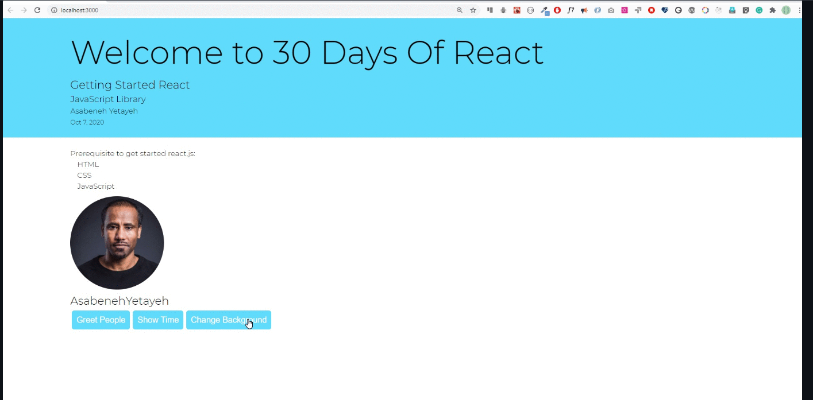
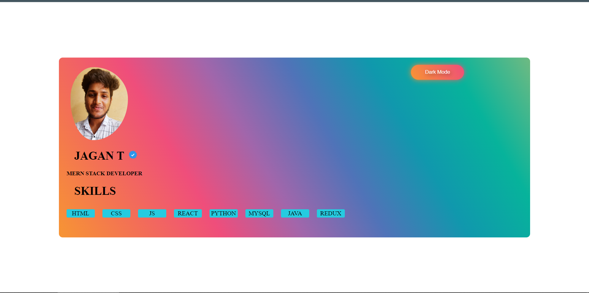

# STATE HANDLING TASKS 

**1. Use React state to change the background of the page. You can use this technique to apply a dark mode for your portfolio.**




```
<!DOCTYPE html>
<html lang="en">
<head>
    <meta charset="UTF-8">
    <meta name="viewport" content="width=device-width, initial-scale=1.0">
    <script crossorigin src="https://unpkg.com/react@18/umd/react.development.js"></script>
    <script crossorigin src="https://unpkg.com/react-dom@18/umd/react-dom.development.js"></script>
    <script src="https://unpkg.com/@babel/standalone/babel.min.js"></script>
    <style>
        .container{
            border-radius: 10px;
            height: 470px;
            width: 80%;
            display: block;
            background: linear-gradient(
                60deg,
                #f79533,
                #f37055,
                #ef4e7b,
                #a166ab,
                #5073b8,
                #1098ad,
                #07b39b,
                #6fba82
            );
            position: fixed;
            top: 50%;
            left: 50%;
            transform: translate(-50%, -50%);
        }
        img{
            border-radius: 50;
        }
        .boxed *{
            text-align: center;
            margin-left: 20px;
            float: left;
            margin-top: 10px;
            border-radius: 3px;
            background-color: rgb(37, 203, 224);
            border: 2px solid rgb(37, 203, 224) ;
            width: 70px;
        }
        .light-mode *{
            background: #fff;
            color: #000;
        }
        .dark-mode *{
            background: #222;
            color: #fff;
        }
        .bn29 {
            margin-top: 20px;
            margin-left: 75%;
            border: none;
            padding: 0.8em 2.5em;
            outline: none;
            color: white;
            font-style: 1.2em;
            position: absolute;
            z-index: 1;
            cursor: pointer;
            background: none;
            text-shadow: 3px 3px 10px rgba(0, 0, 0, 0.45);
            }

            .bn29:before,
            .bn29:after {
            position: absolute;
            top: 50%;
            left: 50%;
            border-radius: 10em;
            -webkit-transform: translateX(-50%) translateY(-50%);
            transform: translateX(-50%) translateY(-50%);
            width: 105%;
            height: 105%;
            content: "";
            z-index: -2;
            background-size: 400% 400%;
            background: linear-gradient(
                60deg,
                #f79533,
                #f37055,
                #ef4e7b
                /* #a166ab,
                #5073b8,
                #1098ad,
                #07b39b,
                #6fba82 */
            );
            }

            .bn29:before {
            -webkit-filter: blur(7px);
            filter: blur(7px);
            -webkit-transition: all 0.25s ease;
            transition: all 0.25s ease;
            -webkit-animation: pulse 10s infinite ease;
            animation: pulse 10s infinite ease;
            }

            .bn29:after {
            -webkit-filter: blur(0.3px);
            filter: blur(0.3px);
            }

            .bn29:hover:before {
            width: 115%;
            height: 115%;
            }
    </style>
</head>
<body>
    <div id="app"></div>
    <script type="text/babel">
        const ShowCard=()=>{
            return(
                <div>
                    
                    <h1  style={{fontSize:30,paddingLeft:40}}>JAGAN T</h1>
                    <h2 style={{fontSize:15,paddingLeft:20}}> MERN STACK DEVELOPER</h2>
                    <h1 style={{fontSize:30,paddingLeft:40}}>SKILLS</h1>
                    <div className='boxed'>
                    <div>HTML</div><div>CSS</div><div>JS</div><div>REACT</div><div>PYTHON</div><div>MYSQL</div><div>JAVA</div><div>REDUX</div>
                    </div>
                    </div>
            )
        }
      const Portfolio = () => {
        const [darkMode, setDarkMode] = React.useState(false);
  
        const toggleDarkMode = () => {
          setDarkMode(!darkMode);
        };
  
        React.useEffect(() => {
          const bodyElement = document.querySelector('body');
          if (darkMode) {
            bodyElement.classList.add('dark-mode');
          } else {
            bodyElement.classList.remove('dark-mode');
          }
        }, [darkMode]);
  
        return (
          <div className='container'>
            <button onClick={toggleDarkMode} className='bn29'>
              {darkMode ? 'Light Mode' : 'Dark Mode'}
            </button>
            <ShowCard/>
          </div>
        );
      };
  
      const rootElement = ReactDOM.createRoot(document.getElementById('app'));
      rootElement.render(<Portfolio />);
    </script>
  </body>
</html>
```
*Output of the above*



**2.After long time of lock down, you may think of travelling and you do not know where to go. You may be interested to develop a random country selector that selects your holiday destination.**


```
<!DOCTYPE html>
<html lang="en">
<head>
    <meta charset="UTF-8">
    <meta name="viewport" content="width=device-width, initial-scale=1.0">
    <script crossorigin src="https://unpkg.com/react@18/umd/react.development.js"></script>
    <script crossorigin src="https://unpkg.com/react-dom@18/umd/react-dom.development.js"></script>
    <script src="https://unpkg.com/@babel/standalone/babel.min.js"></script>
    <link rel="preconnect" href="https://fonts.googleapis.com">
    <link rel="preconnect" href="https://fonts.gstatic.com" crossorigin>
    <link href="https://fonts.googleapis.com/css2?family=VT323&display=swap" rel="stylesheet">
    <link rel="preconnect" href="https://fonts.googleapis.com">
<link rel="preconnect" href="https://fonts.gstatic.com" crossorigin>
<link href="https://fonts.googleapis.com/css2?family=Chela+One&display=swap" rel="stylesheet">
    <title>COUNTRY API</title>
    <style>
        h1{
            margin-top: 1px;
            text-align: center;
            font-family: 'VT323', monospace;
            font-size: 100px;
        }
        #app{
            margin-top: 20px;
            border-radius: 10px;
            height: 80%;
            width: 40%;
            display: block;
            position: fixed;
            top: 50%;
            left: 50%;
            transform: translate(-50%, -50%);
            background: wheat;
        }
        .container{
            margin-top: 40px;
            align-items: center;
            text-align: center;
        }
        .text{
            font-size: 30px; 
            font-family: 'Chela One', cursive;
            margin-top: 20px;
            margin-left: auto;
        }
        .bn47 {
        margin-top: auto;
        position: relative;
        padding: 1rem 2rem 0.5rem 2.5rem;
        color: #000000;
        border: 3px solid #776e62;
        -webkit-transition: padding 0.3s ease-in-out;
        transition: padding 0.3s ease-in-out;
        }

        .bn47:before {
        content: "";
        position: absolute;
        top: 0.5rem;
        left: 0.5rem;
        z-index: -1;
        height: 100%;
        width: 100%;
        background-color: #ffffff;
        border-right: 3px solid #ffffff;
        border-bottom: 3px solid #ffffff;
        -webkit-transition: all 0.3s ease-in-out;
        transition: all 0.3s ease-in-out;
        }

        .bn47:hover {
        padding: 0.75rem 2.25rem;
        }

        .bn47:hover:before {
        top: 0;
        left: 0;
        }
        .foot {
            text-align: center;
            position: fixed;
            padding: 10px 10px 0px 10px;
            bottom: 0;
            width: 100%;
            /* Height of the footer*/
            height: 40px;

        }
    </style>
</head>
<body>
    <h1>RANDOM COUNTRY</h1>
    <div id="app"></div>
    <script type="text/babel">
        function refreshPage(){
    window.location.reload();
    }
    const CountryInfo = () => {
      const [countryData, setCountryData] = React.useState({});
      const [isLoading, setIsLoading] = React.useState(true);

      React.useEffect(() => {
        setIsLoading(true);
        fetch("https://restcountries.com/v3.1/all")
          .then((response) => response.json())
          .then((data) => {
            if (Array.isArray(data) && data.length > 0) {
              // Parse the response data to extract the flag image, country name, population, and currency
              const country = data[Math.floor(Math.random() * data.length)];
              const flag = country.flags.png;
              const name = country.name.common;
              const capital = country.capital?.[0] || "Unknown";
              const population = country.population;
              const currency = Object.keys(country.currencies)[0];

              // Update the state variables with the parsed data
              setCountryData({ flag, name,capital, population, currency });
            } else {
              console.log("Invalid data format:", data);
            }
            setIsLoading(false);
          })
          .catch((error) => {
            console.log("Error:", error);
            setIsLoading(false);
          });
      }, []);

      if (isLoading) {
        return <p>Loading...</p>;
      }

      return (
            <div className='container'>
            {countryData.flag && }
                <div className="text">
                    <h2 >{countryData.name}</h2>
                    <h3 >{countryData.capital}</h3>
                    <p >Population: {countryData.population}</p>
                    <p >Currency: {countryData.currency}</p>
                    <button type='reset' className="bn47" onClick={()=>{location.reload();}} >Dice</button>
                </div>
            </div>
      );
    };

    const rootElement = ReactDOM.createRoot(document.getElementById('app'));
    rootElement.render(<CountryInfo />);
    </script>
    <div>
        <footer class="foot">&copy; Copyright 2023 @BalaTheDeveloperOps  </footer>
    </div>
    
</body>
</html>

```

*Output of the above*


